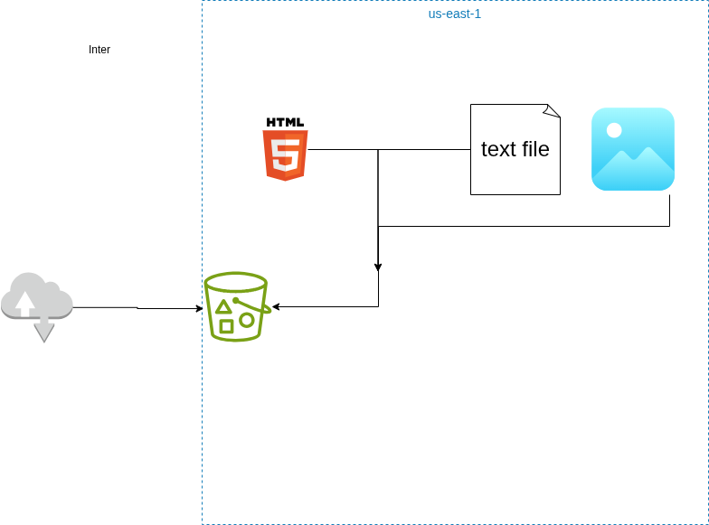

# Day 4 - Introduction to S3 - Quick Notes

**Date:** 12/16/2025 | **Time:** 4 hours | **Status:** ✅ Complete 

---

## 🎯 Today's Goals

- [X] Understanding what is S3 (Simple Storage Service)
- [X] Understanding the concept of buckets and objects
- [X] Overview of S3 storage classes
- [X] Understanding S3 Bucket naming convention

---

## 📚 What I Learned (5-Minute Summary)

**Main Topic:** Amazon S3 (Simple Storage Service)

**Key Takeaways:**
1. S3 is object-based storage designed for durability and scalability, not traditional file system or operating systems
2. Everything in S3 lives inside a bucket, and every file is stored is an object with metadata and permissions attached
3. Storage classes exist to balance cost and access needs - choosing the right one matters just as much as storing the data itself.

**New Terms:**
- **Bucket:** A globally unique container that holds objects in S3 and defines configuration, permissions, and region
- **Object:** A file stored in S3 that includes data, metadata, and unique key (name).

---

## 🛠️ What I Built

**Exercise/Project:** Static Website Hosted on Amazon S3

**What I did:**
- Created an S3 bucket following AWS naming conventions
- Uploaded static website files (HTML and tex objects)
- Configured bucket permissions and object ownership
- Disabled public access blocks intentionally and securely
- Made objects publicly readable to host a static website
- Verified access via the S3 public URl

***

***

***

**Result:**
I successgully hosted a static website using Amazon S3 and accessed it publicly through a browser.  This confirmed my understanding of buckets, objects, permissions, and how S3 can be used for real-world workloads beyond simple file storage. 

**Screenshots:** 

### 1. Click on Create bucket

### 2. Naming Bucker"

### 3. Click on Create bucket

### 4. Click on shannon-aws-learning-2025

### 5. Click on Upload

### 6. Click on Add files

### 7. Select a file from upload menu

### 8. Click on Upload

### 9. Click on Close

### 10. Click on text-for-s3-bucket.txt

### 11. Click on URL for text file

### 12. Click on shannon-aws-learning-2025

### 13. Click on Permissions

### 14. Click on Edit

### 15. Uncheck Block all public access

### 16. Click on Save changes

### 17. Type "confirm"

### 18. Click on Confirm

### 19. Click on Edit

### 20. Click on Object Ownership

### 21. Check I acknowledge that ACLs will be restored.

### 22. Click on Save changes

### 23. Click on Objects

### 24. Click on index.html

### 25. Click on Object actions

### 26. Click on Make public using ACL

### 27. Click on Make public

### 28. Click on Close

### 29. Right click on https://shannon-aws-learning-2025.s3.us-east-1.amazonaws.com/index.html

### 30. Click on Hello From S3

 

---

## 💡 Key Learning

**One thing I'll remember from today:**
S3 is simple by design, but access control is powerful - storage without intentional permissions ie either useless or dangerous.

**How I'll use it:**
I'll use S3 as the backbone for static sites, logs, backups, and future data pipelines, always choosing storage classed and permissions deliberatley instead of defaulting blindly.

---

## 🐛 Problems Faced

**Problem:** 
Understanding why objects weren't publicly accessible even after upload

**Solution:** 
I learned that S3 blocks public access by default. I had to intentionally update bucket permission, object ownership, and ACL settings to allow public access.

**Lesson:** 
AWS defaults prioritie security - accessibility is always something you must explicitly allow.

---

## 💰 AWS Resources

**Created Today:**
- S3 Bucket - Status: Active
- Static Website Objects - Status: Publicly Accessible

**Cleanup Status:**
- [X] All resources stopped/terminated
- [X] Billing checked: $0

---

## 📅 Tomorrow

**Focus:** Connecting EC2 and S3

**To-Do:**
- [ ] Create an IAM roles for EC2
- [ ] Understand how applications authenticate to AWS services
- [ ] Undersand why IAM roles are better than access keys for EC2

**Questions to Answer:**
- When should S3 not be used?
- How does S3 fit into production cloud architecture

---

## ✅ Quick Check

- [X] Learned something new
- [X] Built something working
- [X] Documented progress
- [X] Cleaned up AWS resources
- [X] Updated main README
- [X] Committed to GitHub

---

**Daily Win:** Hosting a live static website on S3 fully understanding why it works - not just that it workss.

**Tomorrow's Promise:** I wll treat cloud storage as architecture, not just a place to dump files.

---

**Day 4/90 Complete** ✓