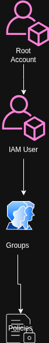
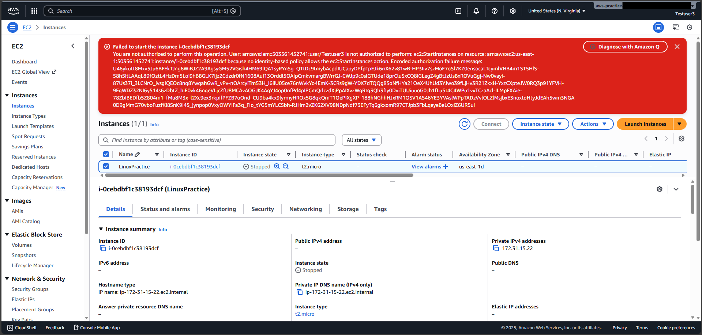

# Day 2 - Introduction to IAM - Quick Notes

**Date:** 12/12/2025 | **Time:** 5 hours | **Status:** ✅ Complete

---

## 🎯 Today's Goals

- [X] IAM overview: Users, Groups, Policies, Roles
- [X] Understanding AWS permission model
- [X] Principle of least privilege

---

## 📚 What I Learned (5-Minute Summary)

**Main Topic:** AWS Identify and Access Management (IAM)

**Key Takeaways:**
1. A single IAM user can belong to multiple groups - and that's the cleanest way to manage permission
2. IAM is all about controlling "who can do what" inside AWS. Users, Groups, Policies, and Roles all connect to enforce secure access
3. The principle of least privilege is non-negotiable - always give the minimum permissions a person or service needs, nothing extra

**New Terms:**
- **IAM User:** A person or application that interacts with AWS using a username/password or access keys
- **IAM Role:** A temporary identity with specific permissions that a user or service can assume when needed

---

## 🛠️ What I Built

**Exercise/Project:** Added IAM user and groups

IAM Architecture Diagram



**What I did:**
# [Create IAM Users with EC2 Access](https://app.tango.us/app/workflow/8730f5e4-6374-41bd-b30f-ee8f5480d130?utm_source=markdown&utm_medium=markdown&utm_campaign=workflow%20export%20links)

***

## # [Console Home | Console Home | us-east-1](https://us-east-1.console.aws.amazon.com/console/home?nc2=h_si&region=us-east-1&src=header-signin#)

### 1. Click on IAM


### 2. Click on Users


### 3. Click on Create user


### 4. Click on User name


### 5. Type "Testuser1"


### 6. Click on Next


### 7. Check on


### 8. Click on Next


### 9. Click on Create user


### 10. Click on Testuser1


### 11. Click on Add permissions


### 12. Click on Add permissions


### 13. Select Attach policies directly


### 14. Type "EC2"


### 15. Check on


### 16. Click on Next


### 17. Click on Add permissions


### 18. Click on Security credentials


### 19. Click on Enable console access


### 20. Select Custom password


### 21. Paste input


### 22. Click on Enable console access


### 23. Click on Close


<br/>

***

# [Create a Finance Dept User Group in IAM](https://app.tango.us/app/workflow/5bb6cc2b-2999-480c-94ad-6c4e1331f27b?utm_source=markdown&utm_medium=markdown&utm_campaign=workflow%20export%20links)


***


## # [Console Home | Console Home | us-east-1](https://us-east-1.console.aws.amazon.com/console/home?region=us-east-1)

### 1. Type "IAM"


### 2. Click on IAM


### 3. Click on User groups


### 4. Click on Create group


### 5. Type "Finance Dept"


### 6. Type "Bill"


### 7. Check on


### 8. Check on


### 9. Check on


### 10. Click on Create user group


### 11. Type "Finance-Dept"


### 12. Click on Create user group


<br/>

***

**Commands Used:**
```bash
# No CLI commands used today
```

**Result:** I created users and groups, assigning each user to a group with the exact policies they needed. One user had full EC2 access, while the other was limited to read-only permissions.


**Screenshots:** 

User with read-only permission for the EC2


---

## 💡 Key Learning

**One thing I'll remember from today:**
Never use the root account for everyday tasks - IAM exists for a reason, and using the right identities keeps my environment secure and manageable.

**How I'll use it:**
By creating dedicated users, groups, and roles for every task going forward. No more "quick fixes' using root. Everything I build from here on will follow least privilege and clean permission boundaries.

---

## 🐛 Problems Faced

**Problem:** One of the users I created had full EC2 access on paper, but still couldn't connect to the instance using EC2 Instance Connect. The permission looked right, but weren't complete.
Original Permission(./screenshot/permission-before.png)

**Solution:** I reviewed the IAM policy and discovered the missing EC2 Instance Connect permission. After attaching the correct policy, the user could connect successfully.
Adding the correct permission(./screenshot/permission-after.png)

**Lesson:** If something isn't working in AWS, always check the permission policy first - IAM will expose you quick.

---

## 💰 AWS Resources

**Created Today:**
- IAM Users
- IAM Groups
- EC2 Instance - Status: Stopped

**Cleanup Status:**
- [X] All resources stopped/terminated
- [x] Billing checked: $0

---

## 📅 Tomorrow

**Focus:** EC2 Instance

**To-Do:**
- [ ] Understand what is EC2 (Elastic Compute Cloud)
- [ ] Instance types overview
- [ ] Amazon Machine Images (AMIs)
- [ ] Security Groups Basics
- [ ] SSH Key pairs


---

## ✅ Quick Check

- [X] Learned something new
- [X] Built something working
- [X] Documented progress
- [X] Cleaned up AWS resources
- [X] Updated main README
- [X] Committed to GitHub

---

**Daily Win:** 
Creating users and groups confidently - and fixing a permission issue on my own without panicking

**Tomorrow's Promise:** 
I will dive into EC2 with intention and clarity, and I'll build only what I understand.

---

**Day 2/90 Complete** ✓


